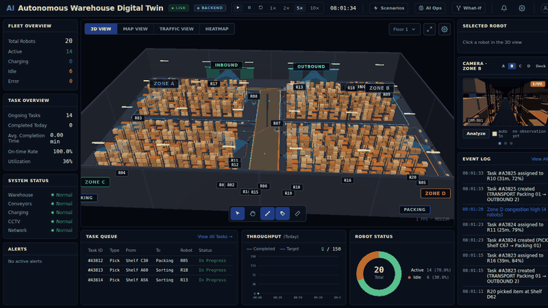
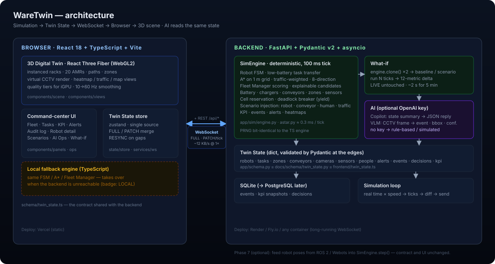

<div align="center">


# WareTwin

**AI Autonomous Warehouse Digital Twin**

*A browser-native digital twin for simulating autonomous robot fleets, operational events, AI-driven decisions and what-if scenarios — before real-world deployment.*

[](../../actions)
[](LICENSE)
[](https://react.dev)
[](https://docs.pmnd.rs/react-three-fiber)
[](https://fastapi.tiangolo.com)
[](https://python.org)
[](https://typescriptlang.org)

[**Live demo**](https://ware-twin.vercel.app) · [Demo script](docs/DEMO.md) · [Architecture](#-architecture) · [繁體中文](README.zh-TW.md)



</div>

---

## ✨ What it does

WareTwin is a real-time **3D digital twin** of a 100 × 70 m warehouse with **20 autonomous mobile robots**, four zones, conveyors, packing stations, chargers and virtual CCTV. A deterministic simulation engine drives every robot through a full state machine (pick → transport → deliver, low-battery hand-off, obstacle re-planning); a Fleet Manager assigns tasks with **explainable scoring**; an AI layer watches the same state to **explain**, **perceive** and **predict**.

It runs on a laptop with an integrated GPU — no RTX, no ROS, no cloud required.

| | |
|---|---|
| 🏭 **3D Digital Twin** | React Three Fiber scene from a single `warehouse_layout.json`: instanced racks, AMRs with live A* paths, zone overlays, virtual CCTV, map / traffic / heatmap views. Quality tiers for integrated GPUs. |
| 🤖 **Robot fleet simulation** | Deterministic 100 ms tick engine: FSM, 8-direction A* on a traffic-weighted grid, cell reservation with deadlock breakers, battery model with charger scheduling, conveyors that actually bottleneck stations. |
| 🧠 **Explainable Fleet Manager** | Every assignment shows the selected robot's reasons (distance, battery, workload, congestion, health) and why each rejected candidate lost. |
| ⚡ **Scenario injection** | Robot failure, low battery, conveyor stop, human intrusion (zone block + re-route), traffic congestion, camera outage, demand burst — one click each, all reversible. |
| 🔮 **What-if simulation** | Clone the live twin, inject, run 1–10 min, compare 12 metrics against a baseline with the same random seed. The live system is never touched. |
| 💬 **AI Operations Copilot** | Ask "Why is throughput dropping?" — the answer is grounded in the live state and cites robots / tasks / events you can click. LLM optional (see [AI modes](#-ai-modes)). |
| 🏢 **Multi-floor & freight lifts** | A steel-framed mezzanine (thick slab, beams, columns, railings) with its own racks, zone, cameras and nav grid. Two freight lifts run a full backend-authoritative state machine — reservation, FIFO queues, sliding gates with safety interlocks (never moves with a gate open), smoothstep platform motion the robot rides on, cooldown, faults with automatic re-routing to the other lift. Robots go Queue → Board → Ride → Alight → Re-plan; floors change only inside that flow. |
| 📡 **On-robot perception** | Each AMR carries a virtual 270° / 4 m LiDAR: it sees other robots and people (with line-of-sight occlusion by racks), slows down and holds distance instead of relying on grid reservations alone, and reports `CLEAR / SLOWING / STOPPED` plus the obstacles it sees — visualised as a sensor fan in 3D. |
| 👁️ **VLM perception** | Send a virtual CCTV frame to a vision model → `{event, severity, bbox, confidence}` drawn on the feed. |
| 🔌 **Real-time sync** | FastAPI + WebSocket: one `FULL` state, then per-tick `PATCH` diffs (~12 KB/s). If the backend is unreachable the browser falls back to a built-in TypeScript engine and keeps running. |
| 📜 **Audit log & KPI** | Every event persisted to SQLite with filters and CSV/JSON export; throughput, utilization, on-time rate, wait time, congestion, energy. |

## 🚀 Quick start

**Prerequisites:** Node 18+, Python 3.11 (conda or venv).

```bash
git clone https://github.com/WayneChou-bot/WareTwin.git && cd WareTwin

# backend
cd backend
conda create -n waretwin python=3.11 -y && conda activate waretwin   # or: python -m venv .venv
pip install -r requirements-dev.txt   # runtime + pytest/httpx (requirements.lock = fully pinned, used by Render/Docker)
uvicorn app.main:app --reload --port 8000

# frontend (new terminal)
cd frontend
npm install
npm run dev          # → http://localhost:5173
```

The top bar shows a blue **BACKEND** badge when the browser is connected to the Python engine, or an orange **LOCAL** badge when it is running the built-in fallback engine. On Windows, `dev.ps1` starts both.

Then follow the [demo script](docs/DEMO.md) — ten scenarios, from normal operation to a compound failure handled end-to-end.

## 🧩 AI modes

The AI layer never needs a key to run. Set `OPENAI_API_KEY` in `backend/.env` (see `.env.example`) to switch from demo mode to live models:

| | Demo mode (default, no key) | LLM mode |
|---|---|---|
| Copilot | Rule-based analysis of the live state (throughput, congestion, assignment, failure risk, improvement), with citations | `gpt-4o-mini`, JSON-schema output, citations restricted to ids present in the snapshot |
| VLM | Simulated perception from ground truth (`sim` tag) | Vision model on the actual CCTV frame |
| What-if recommendation | Templated two-liner from the deltas | LLM two-liner |

The public demo runs in demo mode on purpose: it is fully functional and cannot run up an API bill.

## 🏗 Architecture



The **Twin State** is the single contract — `frontend/src/schema/twin_state.ts` ≡ `backend/app/schema.py` (Pydantic). Both engines share the same PRNG bit-for-bit, so the task stream and assignments are identical; What-if runs on the backend by deep-cloning the engine (state + FSM runtime + RNG).

```
WareTwin/
├── frontend/        React 18 · TypeScript · Vite · React Three Fiber · zustand
│   └── src/simulation/   TypeScript engine (local fallback)
├── backend/         FastAPI · Pydantic v2 · asyncio · SQLite
│   └── app/sim/          Python engine · A* · What-if
│   └── app/ai/           Copilot · VLM
├── docs/            schema · layout generator · demo script · screenshots
└── dev.ps1
```

## 🧪 Tests

```bash
cd backend && python -m pytest -q      # 45 tests: PRNG parity, A*, 20-min stress (no collisions < 0.5 m), determinism, lifts,
                                        #           low battery, intrusion, gridlock-free compound failure, WS/REST, AI, What-if
cd frontend && npm test                 # 24 tests: same engine contract in TypeScript
```

## ☁️ Deployment

Frontend is static (Vercel / GitHub Pages); backend is a long-running WebSocket service (Render / Fly.io / any container — not serverless). `backend/render.yaml`, `Dockerfile`, `fly.toml` and `frontend/vercel.json` are included; set `VITE_WS_URL=wss://…/ws` on the frontend and `TWIN_CORS_ORIGINS` on the backend. Details in [`frontend/README.md`](frontend/README.md#部署).

## 🔒 Running it in public

The hosted demo is deliberately a **single shared simulation** — every visitor sees the same warehouse and can inject the same failures, which is the point of the demo. To keep that safe the backend ships with a small guard layer (`backend/app/guard.py`):

| Guard | Default |
|---|---|
| Input limits | `TASK_BURST.count ≤ 30`, injections ≤ 10 min, What-if ≤ 8 injections / 10 min, Copilot question ≤ 500 chars, VLM frame ≤ 400 KB; task locations must exist, match the task type and never be a charger (`sim/rules.py`, mirrored in TS) |
| Rate limit (per client IP, in-memory, GC'd) | mutations 20/min · Copilot & VLM 10/min · What-if 4/min · WebSocket messages 120/min → `429` / `RATE_LIMITED`. Client IP is the last hop of `X-Forwarded-For` (`TWIN_TRUSTED_PROXIES`), so it cannot be spoofed |
| Origin check | when `TWIN_CORS_ORIGINS` is set, WebSocket and POST must carry an allowed `Origin`. Production allows only `https://ware-twin.vercel.app`; Vercel previews are off unless you add a `TWIN_CORS_REGEX` pinned to your own scope slug (`TWIN_ALLOW_NO_ORIGIN=1` re-enables curl) |
| Body size | REST 512 KB counted on the ASGI stream (chunked / forged `Content-Length` included), WebSocket message 64 KB (UTF-8 bytes) |
| Health | `/api/health` returns `503` when the simulation task died or has not advanced for `TWIN_HEALTH_STALL_S` seconds, so Render restarts it |

Reads (`/api/state`, `/api/health`, …) are never limited. `TWIN_RATE_LIMIT=0` switches the limiter off for local development. The UI is built for desktop (best ≥ 1280 px, usable from 1024 px); narrower screens get a notice instead of an unreadable 0.25× layout, and the simulation is not started behind it. Audit history lives in SQLite on the instance and resets when the free-tier instance is replaced.

## 🗺 Roadmap

- [x] Phase 1 – 3D foundation · [x] Phase 2 – robot simulation · [x] Phase 3 – backend + WebSocket · [x] Phase 4 – operations · [x] Phase 5 – AI · [x] Phase 6 – What-if · [x] Phase 7 – on-robot perception · [x] Phase 8 – multi-floor + freight lifts, animated conveyors
- [ ] Phase 9 – Robotics extension: feed robot poses from ROS 2 / Webots into `SimEngine.step()`; the Twin State contract and UI stay unchanged
- [ ] Multi-agent path planning (CBS / time-window reservations) to replace the yield/back-off deadlock breaker
- [ ] PostgreSQL + Redis for multi-instance deployments

## 📚 Data & acknowledgements

- The warehouse layout is **synthetic**, generated by `docs/layout/gen_layout.py`; no third-party map or open dataset is used.
- Fonts: [Inter](https://rsms.me/inter/) and [JetBrains Mono](https://www.jetbrains.com/lp/mono/) via Google Fonts (SIL OFL 1.1).
- Built with [Three.js](https://threejs.org) · [React Three Fiber](https://docs.pmnd.rs/react-three-fiber) · [drei](https://github.com/pmndrs/drei) · [zustand](https://github.com/pmndrs/zustand) · [FastAPI](https://fastapi.tiangolo.com) · [Pydantic](https://docs.pydantic.dev) · [OpenAI Python SDK](https://github.com/openai/openai-python) — all MIT/BSD/Apache licensed.
- The reference imagery used during design (NVIDIA Isaac Sim screenshots, AMR product photos) is not included in this repository.

## 📄 License

[MIT](LICENSE) © 2026 Wayne Chou
